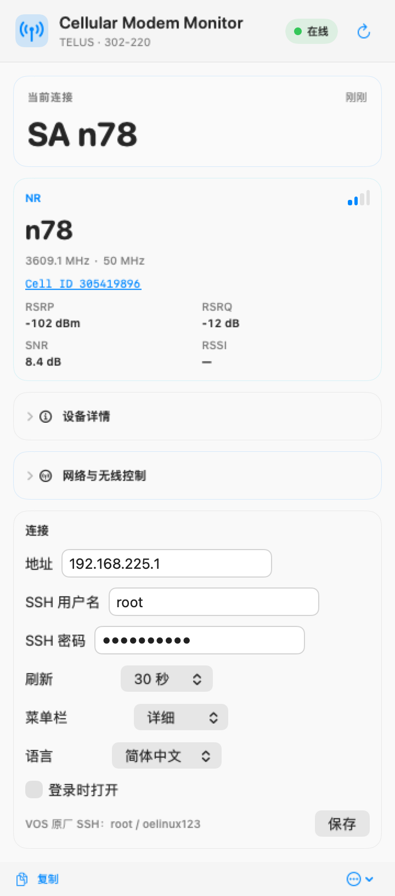
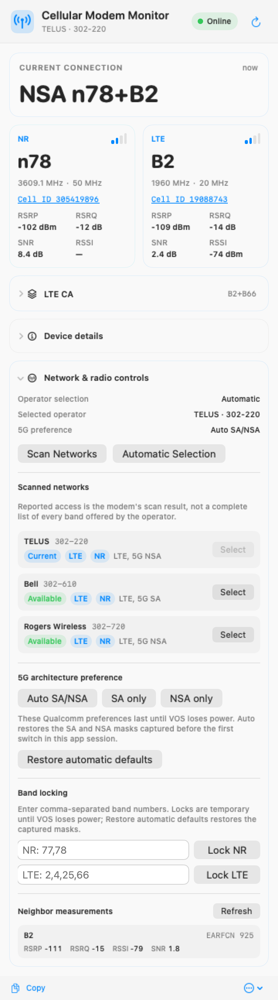

# Cellular Modem Monitor for macOS

English | [简体中文](README.zh-CN.md)

**Cellular Modem Monitor** is a native macOS menu-bar app for viewing live cellular
radio information from supported USB modems. This release supports **VOS 5G**;
additional modem backends can be added in future releases.

It reads the modem through SSH and the Qualcomm QRTR/QMI services available on
VOS. Normal status polling is read-only. The optional, explicitly opened
**Network & radio controls** panel can change operator registration, temporary
SA/NSA preferences and temporary LTE/NR band masks after confirmation.

<p align="center">
  
  
  <br>
  <sub>5G SA n78 and NSA n78+B2 examples; demo values use synthetic Cell IDs.</sub>
</p>

## Features

- Live primary 5G NR and LTE bands in the menu bar
- Explicit SA/NSA mode from Qualcomm DSD, without guessing from band combinations
- RSRP, RSRQ, RSSI and SNR when each metric is reported by the modem
- Human-readable downlink frequency and channel bandwidth; raw ARFCN remains in diagnostics
- Serving NR/LTE global Cell ID; detailed LTE PCell/SCell aggregation
  with exact per-carrier signal values when QMI can associate them
- Clickable Cell IDs: LTE opens CellMapper's prefilled ID calculator; NR copies
  the full NCI and opens the matching MCC-MNC's NR map for **Cell Search**
- Operator-name lookup from the serving PLMN, PLMN, USB interface and firmware versions
- Detailed, compact and icon-only menu-bar styles
- English and Simplified Chinese UI; Chinese macOS installations default to
  Simplified Chinese, while other system languages default to English. The
  language can be changed instantly in Settings.
- Manual refresh, adjustable 1/5/10/15/30/60-second polling and launch at login
- Copyable diagnostics for troubleshooting
- Network scanning with operator name, MCC-MNC, availability and reported
  LTE/NR access technology
- Manual PLMN selection without forcing an access technology, automatic
  operator selection, and `AT+COPS?` read-back verification
- Auto SA/NSA, SA only and NSA only controls with exact Qualcomm mode/mask
  read-back, failure rollback and one-click restoration
- Temporary NR and LTE band locks with allowlist validation, exact QMI read-back
  and restoration of the masks captured from the attached modem
- Read-only LTE neighbor measurements reported by Qualcomm NAS

<p align="center">
  
  <br>
  <sub>Runtime language selection in Settings (Simplified Chinese shown).</sub>
</p>

## Menu-bar labels

The app displays only information confirmed by the modem:

| Label | Meaning |
| --- | --- |
| `SA n78` | DSD explicitly reports 5G Standalone |
| `NSA n78+B2` | DSD explicitly reports 5G Non-Standalone with NR n78 and LTE B2 |
| `NR n78+B2` | The bands are known, but DSD did not provide an unambiguous mode |
| `LTE B2` | LTE B2 is active |
| `n78+B2` | Compact menu-bar style |
| `Cellular …` / `Cellular —` | Connecting / unavailable |

When the mode is unknown, the app uses the neutral `NR` label instead of
inferring SA or NSA from the presence of NR and LTE bands.

## Supported devices

VOS 5G is the only supported modem in this release.

| Item | Tested value |
| --- | --- |
| Management address | `192.168.225.1` |
| VOS firmware | `326.73_0R19` |
| Internal modem firmware | `RXMG1.20.00.326_0R05` |
| Default SSH login | `root` / `oelinux123` |

The SSH login is a shared factory credential published for VOS devices. Do not
expose VOS SSH to an untrusted LAN or the Internet.

## Install

The prebuilt release requires macOS 13 Ventura or later and an Apple Silicon
Mac.

1. Download `Cellular-Modem-Monitor-macOS.zip` from the
   [latest release](https://github.com/maigougou/cellular-modem-monitor/releases/latest).
2. Unzip it and move **Cellular Modem Monitor.app** to `/Applications`.
3. Connect the VOS 5G directly to the Mac and start the app.
4. Allow **Local Network** access if macOS asks.
5. If necessary, open **Settings…** and change the address or SSH login.

The default refresh interval is 30 seconds. Settings also provides 1, 5, 10,
15 and 60-second choices. The app inside the release ZIP is
ad-hoc signed and is not notarized with an Apple Developer ID. If macOS blocks
the first launch, Control-click the app and choose **Open** after reviewing the
source.

If Local Network access was denied, enable it in **System Settings → Privacy &
Security → Local Network**, then reopen the app.

## How the VOS 5G backend works

Each normal refresh opens one SSH session and performs read-only queries. If a
new serving PLMN has no name in that response, the first lookup for that PLMN
opens one additional read-only QMI session and caches the result:

```text
Cellular Modem Monitor
  → macOS /usr/bin/ssh
  → temporary Perl probe supplied through stdin
  → VOS qrtr-lookup
  → Qualcomm AF_QIPCRTR
  → NAS and DSD QMI services
```

NAS supplies the active NR/LTE bands, channels, bandwidth, available RF signal
metrics, serving-network data, serving Cell ID, LTE neighbor measurements
and detailed LTE PCell/SCell information. When the serving-system response has
an empty name, the backend resolves it with NAS Get PLMN Name. DSD
supplies the explicit SA/NSA service-option bit. QRTR node and port numbers are
discovered for every query rather than hard-coded. `AT+GMR` and the VOS version
file provide the modem and device firmware versions.

The probe is executed from SSH stdin and is not installed on the VOS. Ordinary
polling does not change bands, USB composition, carrier policy, APN,
registration mode or any persistent setting.

## Network and radio controls

Expand **Network & radio controls** only when you want to change registration:

<p align="center">
  
  <br>
  <sub>Operator, SA/NSA and temporary band controls; demo values use synthetic Cell IDs.</sub>
</p>

- **Scan Networks** runs `AT+COPS=?`. A full scan may take up to two minutes and
  can temporarily interrupt data. Results distinguish current, available,
  forbidden and unknown PLMNs. LTE/NR badges describe the access technologies
  reported by this scan; they are not a complete operator band list.
- **Select** runs `AT+COPS=1,2,"MCCMNC"` and deliberately omits the optional
  access-technology argument. **Automatic Selection** runs `AT+COPS=0`. The app
  verifies either operation by reading `AT+COPS?` afterwards. Because COPS can
  also alter Qualcomm's mode preference on 0R05, the app snapshots and restores
  the current QMI mode and masks around scan/selection operations.
- **Auto SA/NSA**, **SA only** and **NSA only** write Qualcomm NAS system
  selection preferences with change duration set to *power cycle*. Before the
  first switch, the app keeps the original mode plus both 64-byte SA/NSA masks
  in memory. It reads all three fields back after every write and attempts to
  restore the original tuple if verification fails.
- **Restore automatic defaults** restores that captured SA/NSA tuple and
  extended LTE mask plus automatic operator selection. The baseline is bound to a hash of the current
  VOS USB serial, so hot-swapping another unit at the same IP discards the old
  masks; the raw serial is never returned or stored. The masks are intentionally
  not persisted across app launches. If the app was closed after an override,
  disconnecting VOS power restores the Qualcomm power-cycle defaults.
- **Lock NR** and **Lock LTE** accept comma-separated band numbers. The app
  intersects them with the captured factory-enabled masks, writes a temporary
  Qualcomm preference, reads it back exactly and rolls back on failure.
- **Neighbor measurements** refreshes QMI's current LTE measurements; it is not
  an active RF scan. This firmware does not expose a standard NR-neighbor list.

These controls do not edit `carrier_policy.xml`, OEM files, the hardware band
filter, USB composition or APN settings.

## Connection and security notes

- Different VOS units can share `192.168.225.1` while using different SSH host
  keys. For this physically attached local USB network, the VOS backend
  intentionally disables SSH host-key verification and does not modify
  `~/.ssh/known_hosts`. It therefore does not authenticate the SSH server's
  identity. Point the app only at a trusted, locally attached VOS.
- When the default address is used and a `192.168.225.x` USB interface is
  detected, SSH is bound to that source address.
- The SSH password is passed to OpenSSH through the bundled `SSH_ASKPASS`
  helper, not through command-line arguments or diagnostics.
- Connection settings, including the password, are currently stored in the
  macOS user account's application preferences, not in Keychain.
- Clicking an LTE Cell ID sends that ID to CellMapper in the browser URL, where
  it may remain in browser history. Clicking an NR Cell ID copies the NCI to the
  clipboard; it is sent to CellMapper only if you paste it into **Cell Search**.

## Build from source

Install Apple Command Line Tools, then run:

```sh
make test    # tests only
make build   # tests, builds and packages the app
```

The packaged application archive is written to:

```text
dist/Cellular-Modem-Monitor-macOS.zip
```

Source builds target the architecture of the Mac performing the build. Offline
tests cover LTE and NR bands, explicit DSD SA/NSA, signal metrics, Cell ID,
PLMN-name fallback, LTE/NR masks, detailed LTE CA data and malformed QMI
responses. The read-only SSH/QMI path was validated end to end on physical VOS
hardware on 2026-08-31.

## Current limitations

- Only VOS 5G is supported in this release.
- The prebuilt release is Apple Silicon (`arm64`) only.
- Some fields may be absent when the modem or network does not report them.
- Standard LTE CA QMI reports SCell carrier identity/channel/bandwidth but not every SCell's
  global Cell ID or all four signal metrics; unavailable per-carrier values are
  shown as `—` rather than copied from the serving cell.
- The UI currently shows one primary NR band and detailed LTE PCell/SCell data;
  the public QMI path used by this backend does not enumerate multiple NR
  component carriers.
- This app does not unlock bands or edit persistent modem policy files. Its
  operator and SA/NSA controls affect registration and power-cycle-scoped radio
  preferences only.

## Acknowledgements

Device research and community findings:
[eko.one.pl VOS 5G discussion](https://eko.one.pl/forum/viewtopic.php?id=25031).

## License

[MIT](LICENSE)
