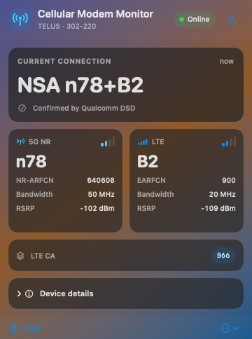

# Cellular Modem Monitor for macOS

English | [简体中文](README.zh-CN.md)

**Cellular Modem Monitor** is a native macOS menu-bar app for viewing live cellular
radio information from supported USB modems. This release supports **VOS 5G**;
additional modem backends can be added in future releases.

It reads the modem directly over SSH and Qualcomm QMI. It does not depend on
the VOS Web UI and does not modify modem settings.

<p align="center">
  
</p>

## Features

- Live primary 5G NR and LTE bands in the menu bar
- Explicit SA/NSA mode from Qualcomm DSD, without guessing from band combinations
- NR-ARFCN, EARFCN, bandwidth and RSRP when reported by the modem
- Active LTE secondary-carrier bands
- Operator, PLMN, USB interface and firmware versions
- Detailed, compact and icon-only menu-bar styles
- Manual refresh, adjustable 1/5/10/15/30/60-second polling and launch at login
- Copyable diagnostics for troubleshooting

## Menu-bar labels

The app displays only information confirmed by the modem:

| Label | Meaning |
| --- | --- |
| `SA n78` | DSD explicitly reports 5G Standalone |
| `NSA n78+B2` | DSD explicitly reports 5G Non-Standalone with NR n78 and LTE B2 |
| `NR n78+B2` | The bands are known, but DSD did not provide an unambiguous mode |
| `LTE B2` | LTE B2 is active |
| `n78+B2` | Compact menu-bar style |
| `Cellular …` / `Cellular —` | Connecting / unavailable |

The detail panel identifies an unknown mode as unavailable instead of inferring
SA or NSA from the presence of NR and LTE bands.

## Supported devices

VOS 5G is the only supported modem in this release.

| Item | Tested value |
| --- | --- |
| Management address | `192.168.225.1` |
| VOS firmware | `326.73_0R19` |
| Internal modem firmware | `RXMG1.20.00.326_0R05` |
| Default SSH login | `root` / `oelinux123` |

The SSH login is a shared factory credential published for VOS devices. Do not
expose VOS SSH to an untrusted LAN or the Internet.

The VOS Web UI uses a separate `admin` / `admin` login. The app does not use
that login; **Open Device Web UI** is only a browser shortcut.

## Install

The prebuilt release requires macOS 13 Ventura or later and an Apple Silicon
Mac.

1. Download `Cellular-Modem-Monitor-macOS.zip` from the
   [latest release](https://github.com/maigougou/cellular-modem-monitor/releases/latest).
2. Unzip it and move **Cellular Modem Monitor.app** to `/Applications`.
3. Connect the VOS 5G directly to the Mac and start the app.
4. Allow **Local Network** access if macOS asks.
5. If necessary, open **Settings…** and change the address or SSH login.

The default refresh interval is 30 seconds. Settings also provides 1, 5, 10,
15 and 60-second choices. The app inside the release ZIP is
ad-hoc signed and is not notarized with an Apple Developer ID. If macOS blocks
the first launch, Control-click the app and choose **Open** after reviewing the
source.

If Local Network access was denied, enable it in **System Settings → Privacy &
Security → Local Network**, then reopen the app.

## How the VOS 5G backend works

Each refresh opens one SSH session and performs read-only queries:

```text
Cellular Modem Monitor
  → macOS /usr/bin/ssh
  → temporary Perl probe supplied through stdin
  → VOS qrtr-lookup
  → Qualcomm AF_QIPCRTR
  → NAS and DSD QMI services
```

NAS supplies the primary active NR/LTE bands, channels, bandwidth, RSRP,
serving-network data and active LTE secondary-carrier bands. DSD supplies the
explicit SA/NSA service-option bit. QRTR node and port numbers are discovered
for every query rather than hard-coded. `AT+GMR` and the VOS version file
provide the modem and device firmware versions.

The probe is executed from SSH stdin and is not installed on the VOS. The app
does not change bands, USB composition, carrier policy, APN, registration mode
or any persistent setting. It neither occupies the single-user Web UI session
nor depends on the VOS self-signed HTTPS certificate.

## Connection and security notes

- Different VOS units can share `192.168.225.1` while using different SSH host
  keys. For this physically attached local USB network, the VOS backend
  intentionally disables SSH host-key verification and does not modify
  `~/.ssh/known_hosts`. It therefore does not authenticate the SSH server's
  identity. Point the app only at a trusted, locally attached VOS.
- When the default address is used and a `192.168.225.x` USB interface is
  detected, SSH is bound to that source address.
- The SSH password is passed to OpenSSH through the bundled `SSH_ASKPASS`
  helper, not through command-line arguments or diagnostics.
- Connection settings, including the password, are currently stored in the
  macOS user account's application preferences, not in Keychain.

## Build from source

Install Apple Command Line Tools, then run:

```sh
make test    # tests only
make build   # tests, builds and packages the app
```

The packaged application archive is written to:

```text
dist/Cellular-Modem-Monitor-macOS.zip
```

Source builds target the architecture of the Mac performing the build. Offline
tests cover LTE and NR bands, explicit DSD SA/NSA, unknown mode, bandwidth,
RSRP, PLMN, active and inactive LTE CA data, and malformed QMI responses. The
SSH/QMI path was manually validated end to end on physical VOS hardware on
2026-08-30.

## Current limitations

- Only VOS 5G is supported in this release.
- The prebuilt release is Apple Silicon (`arm64`) only.
- Some fields may be absent when the modem or network does not report them.
- The UI currently shows one primary NR band, one primary LTE band and active
  LTE secondary-carrier band labels; it does not show multiple NR carriers.
- This is a status viewer, not a band unlocker or modem configuration tool.

## Acknowledgements

Device research and community findings:
[eko.one.pl VOS 5G discussion](https://eko.one.pl/forum/viewtopic.php?id=25031).

## License

[MIT](LICENSE)
