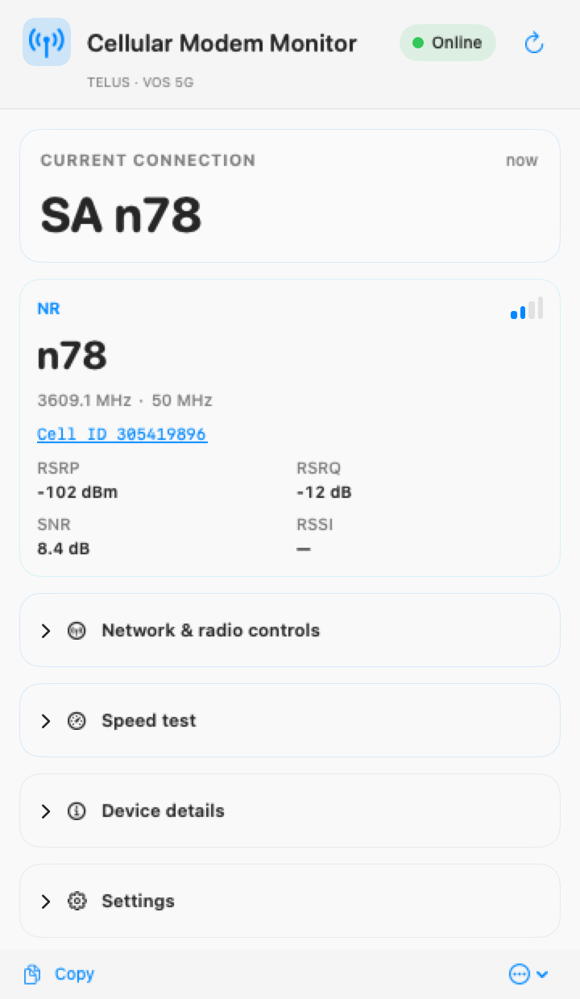
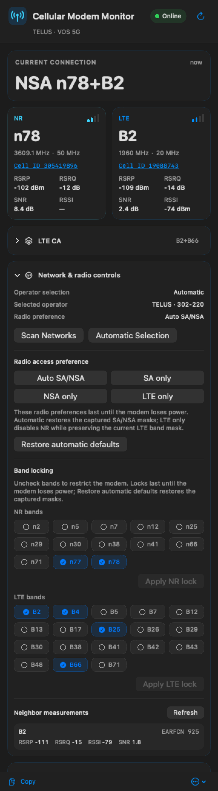

# Cellular Modem Monitor for macOS

[English](README.md) | 简体中文

**Cellular Modem Monitor** 是一款原生 macOS 菜单栏应用，用于查看实时蜂窝
无线状态。当前版本同时支持 **VOS 5G** 与 **ZTE G5 MAX / MC7530CA**。

两种设备的常规状态采集都只读。需要用户主动展开的**网络与无线控制**面板，
可通过 VOS SSH/QMI 后端或 ZTE 认证 Web UBus 后端执行带验证的控制。

<p align="center">
  
  
  <br>
  <sub>VOS 5G SA n78 与 NSA n78+B2 示例；图中使用虚构 Cell ID。</sub>
</p>

## 功能

### 两种后端共有的状态功能

- 在每个活动的物理 IPv4 接口上自动发现设备，不假设 modem 管理地址就是默认网关
- 发现阶段按接口区分候选，使不同链路上的相同私网管理地址保持独立
- 在菜单栏实时显示主要 5G NR 与 LTE 频段
- 仅在当前后端明确报告时显示 SA/NSA 模式
- 显示设备实际提供的 RSRP、RSRQ、RSSI 与 SNR
- 显示更直观的下行频率和信道带宽，原始 ARFCN 保留在诊断信息中
- 在设备数据足以安全关联时显示 NR/LTE 服务 Cell ID 及详细 LTE PCell/SCell
- Cell ID 可点击：LTE 会打开已填好数值的 CellMapper ID 计算器；NR 会复制完整
  NCI，并打开对应 MCC-MNC 的 NR 地图，可用于 **Cell Search**
- 显示运营商、PLMN 和所选网络接口
- 支持详细、紧凑和仅图标三种菜单栏样式
- 提供英文和简体中文界面，可即时切换语言
- 同时提供两种绑定当前 modem 接口的测速，便于直接比较：上方为 macOS
  `networkQuality`，下方为官方 Ookla Speedtest CLI；两者分别显示实时下载/上传
  速度和最终指标
- 支持手动刷新、1/5/10/15/30/60 秒轮询、登录时启动、快速恢复轮询和复制诊断

### 设备控制功能

- 扫描网络、手动选择 PLMN 和恢复自动选网
- Auto SA/NSA、SA only、NSA only、LTE only，并精确读回验证
- 锁定 NR/LTE 频段，按允许列表校验并支持自动失败回滚
- 后端专属的恢复操作及最终读回验证
- 每次写入前验证物理设备身份
- 在当前后端明确支持时读取 LTE 邻区测量

控制始终交给当前活动后端，不会由界面直接调用某种传输。VOS 偏好持续到断电；
MC7530CA 偏好会持久保存，直到再次修改或恢复。界面只显示当前后端声明的能力。

当前设置面板包含自动/VOS/ZTE 选择器、各后端的地址与凭据输入、轮询与显示偏好，
以及运行时语言选择器。密码以未加密形式保存在应用本地文件中，目录/文件权限为
`0700`/`0600`；应用不会请求 Keychain 权限。

## 菜单栏显示规则

应用只显示当前后端明确确认的信息：

| 显示 | 含义 |
| --- | --- |
| `SA n78` | modem 明确报告 5G SA |
| `NSA n78+B2` | modem 明确报告 5G NSA，NR 为 n78、LTE 为 B2 |
| `NR n78+B2` | 频段已知，但组网模式无法唯一确定 |
| `LTE B2` | 当前使用 LTE B2 |
| `n78+B2` | 菜单栏紧凑样式 |
| `Cellular …` / `Cellular —` | 正在连接 / 设备不可用 |

如果无法确认组网模式，应用会使用中性的 `NR` 标识，而不会根据 NR 与 LTE
频段是否同时出现自行判断 SA 或 NSA。

## 支持的设备

| 设备 | 默认管理地址 | 状态传输 | 设备控制 |
| --- | --- | --- | --- |
| VOS 5G | `192.168.225.1` | 通过 SSH 访问 Qualcomm QRTR/QMI | 带读回验证的网络/无线控制 |
| ZTE G5 MAX / MC7530CA | `192.168.254.1` | 认证 Web UBus | 带读回验证的网络/无线控制 |

已测试的 VOS 参考设备报告固件 `326.73_0R19`，内部 modem 固件为
`RXMG1.20.00.326_0R05`。其公开的原厂 SSH 登录为 `root` / `oelinux123`；
如果你的设备不同，请在设置中修改。

ZTE 需要在设置中输入现有 Web 管理员密码，也就是正常管理页面使用的密码。
应用不会内置、推导或显示任何设备专属管理员密码。

两种实机只读状态链路均已于 2026-08-31 完成验证。2026-09-01 已在 MC7530CA 实机
执行仅 SA（`Only_5G`）控制请求，验证 `Z-Mode: 0`、空 `Z-Tag` 的 SID 认证形式，
并通过权威模式回读确认结果。注册后实机报告 TELUS `302-220` SA，最初使用 `n71`，
随后正常重选至 `n77`。完整控制链路另有离线请求、读回、回滚和恢复测试覆盖。

## 连接方式与自动发现

发现层支持以下连接方式：

```text
Mac ← USB ECM ← modem
Mac ← USB 转 RJ45 网卡 / 以太网 ← modem
Mac ← Wi-Fi 或以太网 ← 路由器 ← modem
```

应用会在每个活动的物理 IPv4 接口上检查已注册后端的 profile，包括 VOS 的
`192.168.225.1` 和 ZTE 的 `192.168.254.1`。发现过程排除 loopback、`utun`、
`awdl`、`llw` 和点对点接口。候选键包含协议、主机、端口和接口索引，因此两块
网卡上的同一个私网 IP 仍会被当作不同设备处理。

候选会综合同子网匹配、与接口所报告 router 相同、上次成功和手工输入提示，按固定
规则排序。ZTE HTTP 始终绑定选中的接口；在同子网直连路径中还会绑定已发现的源
地址，在路由路径中则由 Network.framework 为该接口选择源地址。VOS SSH 使用
选中的源地址，但不会再额外绑定接口索引。

在经过路由器的路径中，modem 管理地址**不需要**是 Mac 的默认网关；
但选中接口必须已经存在一条能够到达该地址的有效路由。应用依赖 macOS 的这条
现有路由，不会检查完整路由表，也不会创建或修改系统路由。

## 绑定接口的测速

**测速**卡包含两个独立的结果区，便于直接比较：上方调用 macOS 13 及更高版本
自带的 `networkQuality`，并传入 `-s` 让下载和上传顺序执行；下方调用另行安装的官方
[Ookla Speedtest CLI](https://www.speedtest.net/apps/cli)。Ookla 官方给出的 macOS
Homebrew 安装方式为：

```sh
brew tap teamookla/speedtest
brew update
brew install speedtest --force
```

应用会检查 Apple Silicon/Intel Homebrew 的标准路径及 `PATH`，不会捆绑或自动下载
Ookla 二进制。发送测速流量前，应用还会验证命令确实自报为 **Speedtest by Ookla**。
运行 Ookla 测速时会传入其规定的接受参数，并受界面中链接的 Ookla EULA 与隐私条款
约束。

`networkQuality` 会直接接收为当前活动 modem 动态发现的精确接口。在部分 Darwin
版本上，Ookla CLI 1.2.0 只要传入 `--interface` 或 `--ip` 就无法创建 socket，但不
绑定时可以正常测速。因此应用会在启动 Ookla 前生成一份“失败即关闭”的路由证明：
当前所有 IPv4/IPv6 默认路由必须同时指向动态发现的 modem 接口，并冻结接口索引及
该接口拥有的 IPv4/IPv6 地址；运行期间及结束后持续复核。最终 Ookla JSON 必须报告
同一接口及其中一个已冻结地址。默认路由分裂、接口变化或地址不符都会在发送流量前
拒绝或在运行中取消测速，不允许使用无法确认的出口。

两个按钮会互锁，避免两种测速同时争抢带宽。实时下载/上传值来自已验证接口的字节
计数器，最终 `networkQuality` 结果也必须报告同一接口。Ookla 机器可读结果中的
`bandwidth` 单位为字节/秒，应用会换算为比特/秒后统一显示。

官方 Ookla CLI 本身就按延迟、下载、上传的顺序运行，并没有额外的“顺序模式”开关
（Ookla 中的 `-s` 表示服务器 ID）。两种测速运行时，实时方块读取整个接口的字节
计数器，因此 TCP 确认包或接口上的其他流量可能令反方向显示少量速度；最终结果始终
采用对应测速工具自己报告的数值。

USB 或以太网直连时，这能把公网测速绑定到 modem 的 Mac 接口。对于
Mac → 路由器 → modem 这类路由路径，它能证明每种测速都经过 Mac 到路由器的
接口；路由器内部的 WAN、VPN 和多 WAN 选择仍由路由器控制。运行两种测速会消耗
大量流量，请仅在可以接受该流量消耗时启动。

## 安装

预编译版本需要 macOS 13 Ventura 或更新版本，以及 Apple Silicon Mac。

1. 从 [最新 Release](https://github.com/maigougou/cellular-modem-monitor/releases/latest)
   下载 `Cellular-Modem-Monitor-macOS.zip`。
2. 解压并将 **Cellular Modem Monitor.app** 移到 `/Applications`。
3. 直接连接受支持 modem、通过以太网适配器连接，或通过已经具有管理地址路由的
   路由器连接。
4. 启动应用；如果 macOS 询问本地网络访问权限，请选择**允许**。
5. 展开位于**设备详情**下方的**设置**卡片，选择**自动**、**VOS 5G** 或
   **ZTE G5 MAX / MC7530CA**，然后输入对应凭据。

Release ZIP 内的应用使用 ad-hoc 签名，没有 Apple Developer ID 公证。若 macOS
首次阻止启动，请在核对源码后按住 Control 点击应用并选择**打开**。

如果曾拒绝本地网络权限，请前往**系统设置 → 隐私与安全性 → 本地网络**重新
开启权限，然后退出并重新打开应用。

### 更新

1.5.0 是首个具备更新能力的版本，因此仍需手动安装一次。从 1.5.0 开始，应用每天
检查一次已签名的更新源，发现新版本后由用户确认安装；主界面的**设置**卡片中也提供
**检查更新…**按钮。

更新功能使用 Sparkle 2.9.6。Release 压缩包和更新源均使用本项目的 Ed25519 密钥
签名，并在解压前验证。由于本项目没有 Apple Developer ID，应用仍使用 ad-hoc
签名；Sparkle 签名用于确认更新来源，但不能代替 Apple 公证。更新检查不会发送系统
配置资料。

## 首次设置与日常使用

1. 保持设备选择为**自动**，即可尝试所有已注册后端；也可以选择一种后端来限制
   发现范围。
2. VOS 需要输入 SSH 用户名和密码；ZTE 需要输入 Web 管理员密码。
3. 通常保留各后端的默认管理地址即可。修改地址会把该 HTTP/HTTPS 地址作为手工
   发现提示，同时仍保留内置默认地址。
4. 保存设置。应用会发现设备、验证设备身份，然后开始状态轮询。
5. 使用**刷新**立即读取。默认间隔为 30 秒，设置中还可选择 1、5、10、15 和
   60 秒。

轮询检测到 modem 被拔出后，再插入时会使用更快的恢复周期。带电更换物理 SIM
过程中出现的注册中断或 PLMN 变化会在后续轮询中反映出来；后端报告这种变化时，
应用会清除旧运营商和旧无线数据。应用不读取 SIM 标识，因此无法识别既未改变
PLMN、也未产生可观察注册变化的换卡。

## 后端工作方式

### ZTE G5 MAX / MC7530CA

发现阶段先通过匿名 UBus 读取核对预期网络信息 schema，以及
`zwrt_common_info.common_config.wa_inner_version` 中精确的 `MC7530CA` 产品前缀。
两项都匹配后，应用才使用设置中的 Web 管理员密码认证并调用已验证的
`zwrt_zte_mdm.api/get_modem_msn` 方法。应用只保留该值的 SHA-256 摘要作为物理设备
身份，为对应 endpoint/接口复用限定范围的认证 UBus session，并要求身份一致后才开放
任何写入操作。

常规轮询调用只读方法 `zte_nwinfo_api.nwinfo_get_netinfo`。解析器映射设备实际
报告的运营商/PLMN、LTE/NR 频段、信道、带宽、PCI、Cell ID、信号指标和 LTE
载波聚合，不会编造缺失值。

打开控制面板后，同一个限定路径的认证 session 只提供后端声明的无线控制方法。
每项 MC7530CA 无线 RPC 都使用实机验证过的 SID 认证请求形式：`Z-Mode: 0` 和空
`Z-Tag`。在已测试固件上，同一个有效 SID 若改用浏览器式 `Z-Mode: 1` 和方法名
`Z-Tag`，会返回 JSON-RPC `-32002 Access denied`。首次收到 access denied 时，session
只会重新认证一次，并原样重试一次请求。action 路径以 UBus 状态 0 为成功，包括实机
setter 返回的无 payload `result: [0]`；read 和 poll 仍必须返回预期 payload。随后后端
检查 UBus/JSON-RPC 错误，等待异步 modem 工作完成，再通过新的
`nwinfo_get_netinfo` 精确回读。若写入或验证失败，
仅在设备身份仍一致且 API 有所需 setter 时尝试回滚并验证；回滚失败会明确报告。

### VOS 5G

常规每次刷新建立一个 SSH 会话，并仅执行只读查询。若新的服务 PLMN 没有返回
名称，第一次补查该 PLMN 时会额外建立一次只读 QMI 会话并缓存结果：

```text
Cellular Modem Monitor
  → macOS /usr/bin/ssh
  → 通过 stdin 临时执行 Perl 探针
  → VOS qrtr-lookup
  → Qualcomm AF_QIPCRTR
  → NAS 与 DSD QMI 服务
```

NAS 返回活动 NR/LTE 频段、信道、带宽、可用射频指标、注册网络、Cell ID、LTE
邻区测量及详细 LTE PCell/SCell。NAS Get PLMN Name 用于补查空缺的服务网络名称；
DSD 通过明确的 service-option 位返回 SA/NSA。QRTR 节点与端口会在每次查询时
动态发现，不使用写死的数值。`AT+GMR` 与 VOS 版本文件分别提供 modem 和设备
固件版本。

探针只从 SSH stdin 执行，不会安装到 VOS。普通轮询始终只读。

## 网络与无线控制

只有确实需要改变蜂窝注册时，才展开**网络与无线控制**。在两种 modem 上，完整
运营商扫描、手动注册、无线模式切换或锁频都可能暂时中断数据。

面板采用同一套后端无关约定：创建绑定到当前物理 modem 的 session，执行一个
命令，精确读回权威状态；若命令或验证失败，则在安全且受支持时尝试回滚并验证，
回滚失败会明确报告。切换活动 modem、endpoint 或凭据会使该 session 失效。

### VOS 5G 控制路径

- **扫描网络**使用 `AT+COPS=?`。该 VOS 固件在 NR 开启时执行此命令可能重启，
  因此应用会先记录完整 Qualcomm QMI tuple，切换并读回验证仅 LTE 模式，等待无线
  模式稳定后再扫描；无论成功、失败还是取消，都会恢复并验证原来的 LTE/SA/NSA tuple。
- 手动与自动选网使用 `AT+COPS=1,2,"MCCMNC"` 和 `AT+COPS=0`，并以 `AT+COPS?`
  验证。运营商操作前后会保留当前 Qualcomm QMI mode 与频段 tuple。SA/NSA/LTE
  偏好和锁频都会精确读回，并持续到本次断电。
- **恢复自动默认值**写回本次 app session 捕获的自动 tuple，并恢复自动选网。
- session 绑定到 VOS USB serial 的 SHA-256 摘要，原始 serial 不会保存或返回。
- **邻区测量**读取 Qualcomm 当前 LTE 测量，并不是主动射频扫描；该固件没有
  标准 NR 邻区列表。

### ZTE G5 MAX / MC7530CA 控制路径

- 所有已认证 network-info 控制，包括 setter、扫描/状态/结果轮询和权威回读，都使用
  `Z-Mode: 0` 与空 `Z-Tag`。这是在 MC7530CA 实机上验证成功的请求形式；通用 transport
  仍保留两种 header mode，供其他 ZTE 调用路径使用。
- setter 或 action 收到 UBus 状态 0 即为成功，包括实机返回的无 payload JSON-RPC
  `result: [0]`。状态/读回调用与 action 分离；如果状态 0 响应缺少其必需 payload，
  read 路径仍会拒绝。
- 扫描依次使用 `nwinfo_manual_scan`、有界状态轮询和
  `nwinfo_m_netselect_contents`。手动注册会原样回送扫描结果中的 RAT token，并
  轮询 `nwinfo_m_netselect_result`；自动选网则通过 `net_select_mode` 验证。
- 如果 control session 打开时 modem 已处于手动选网，`nwinfo_get_netinfo` 不会返回
  重放该状态所需的精确 `m_rat`。必须先运行**扫描网络**；只有扫描结果中恰好一个
  `current` 行与当前 PLMN 匹配时，后端才会保存该 token。在此之前，改选另一个手动
  网络、恢复自动选网、改变无线模式、LTE/NR 锁频或恢复默认值都会在写入前安全拒绝。
  如果已保存 RAT 与目标 `net_select` 模式不兼容，也会在任何写入前拒绝。
- Auto SA/NSA、NSA only、SA only、LTE only 经 `nwinfo_set_netselect` 精确写入
  零售 token：`WL_AND_NSA`、`LTE_AND_5G`、`Only_5G`、`Only_LTE`。
- LTE 锁频使用 `nwinfo_set_lte_ext_band`；SA 与 NSA 都使用
  `nwinfo_set_nrbandlock`，type 分别为 `0` 与 `1`。已验证产品允许列表为 LTE
  `2,4,5,7,12,13,17,25,26,29,30,38,41,42,43,48,66,71`，NR
  `2,5,7,12,25,29,30,38,41,66,71,77`。
- ZTE 偏好会跨断电持久保存。每项持久控制写入前，后端都会验证完整恢复镜像：
  模式/运营商重放数据、
  GW/LTE/SA/NSA 值、小区锁，以及精确的已验证默认 NRDC 列表。零售 schema 没有
  NRDC setter，因此 NRDC 不是该精确默认值时会在第一次写入前阻止操作。命令成功
  还必须证明请求字段之外的所有持久字段保持不变；固件旁带修改会按失败处理。
  **恢复自动默认值**调用专用方法
  `nwinfo_reset_band_cell_setting`，然后验证精确的 LTE/SA/NSA 厂商列表、
  MC7530CA 旧制式 GW mask、已清除的 LTE/NR 小区锁，以及精确的已验证默认 NRDC 列表，
  最后明确恢复并验证 `WL_AND_NSA` 自动模式。第一次 reset 写入前会先解析并严格校验
  所有可恢复的原状态；遇到响应丢失、读回失败、任务取消或旁带修改后，会在独立的
  未取消恢复任务中执行 reset，再用零售固件对应 setter 重建并验证此前的
  GW/LTE/SA/NSA/小区锁/选网值。某一步响应丢失不会阻止后续恢复步骤，最终以精确
  权威读回判定成功。它不是恢复出厂，也不会读取或修改 APN profile。
- 每次写入前，认证 session 都读取 modem MSN，并只将其 SHA-256 摘要与 session
  身份比较；原始 MSN 不会暴露或保存。一旦发现不匹配，该 session 会永久拒绝
  后续写入，包括对替换设备执行回滚。
- 固件会返回 LTE/NR 邻区字段，但已测试设备尚未提供能够验证格式的非空样本，
  因此应用目前不声明 ZTE 邻区测量可视化能力。

## 连接与安全说明

- Modem 密码以未加密形式保存在
  `~/Library/Application Support/Cellular Modem Monitor/credentials.json`。
  所在目录权限为 `0700`，文件权限为 `0600`，只有当前 macOS 账户能够读取；但以同一
  账户运行的软件仍可读取它。密码不会写入 UserDefaults、endpoint 缓存、管理 URL
  或诊断信息。
- 升级时，旧版本曾保存在 UserDefaults 中的 VOS 密码会迁移到这个本地文件；只有写入
  成功后才删除旧偏好值。v1.3.0–v1.3.3 保存到 macOS Keychain 的凭据不会被本版本
  读取或删除；请在设置中重新输入一次。
- ZTE 发现先匿名读取 schema 和精确产品字段；确认是 MC7530CA 后才认证并调用已验证的
  `get_modem_msn`，只保留其 SHA-256 摘要以绑定物理设备。只有用户在设置中提供有效
  Web 管理员密码后才会读取状态。每个认证 session 及凭据失败门禁仅保留在进程内存中，
  并分别限定到一个 endpoint/接口；控制写入要求 modem-MSN 摘要与认证发现身份一致。
- 不同 VOS 可能共用 `192.168.225.1`，但使用不同 SSH host key。针对这条本地
  modem 链路，VOS 后端会关闭 SSH host-key 验证，也不会修改
  `~/.ssh/known_hosts`；请只连接可信设备和网络。
- VOS SSH 密码通过内置 `SSH_ASKPASS` 小助手传递，不会出现在命令行参数中。
  两种后端的诊断都不会包含凭据或稳定设备标识。
- 点击 LTE Cell ID 会把该 ID 放入 CellMapper 浏览器 URL，可能留在浏览器历史；
  点击 NR Cell ID 会先复制 NCI，只有粘贴到 **Cell Search** 后才会发送。

## 后端架构与添加其他 modem

各传输实现采用共同的 `ModemStatusBackend` 协议。支持写入的后端还会实现
`ModemControlBackend` 并返回绑定设备的 `ModemControlSession`；厂商 token、重试
顺序、基线状态和回滚逻辑不会泄漏到 `StatusModel` 或 SwiftUI。
`ModemDiscoveryProfile` 声明
后端的默认管理 endpoint，`ModemBackendRegistry` 将实现、发现 profile、能力和
凭据策略配对。`ModemCoordinator` 只选择已注册后端，并将发现与状态采集分离。

添加新 modem 时，需要实现后端、增加对应的 `ModemKind`、提供发现 profile 并注册
二者。若要让用户在设置中手工选择它，还需增加 `ModemSelection` case、对应凭据字段
和本地化界面。逐接口拓扑、候选排序、探针超时和 registry 驱动的 coordinator 仍与
具体传输无关。新的写入操作必须声明为明确能力，避免意外出现在只读后端上。

## 从源码构建与测试

安装 Apple Command Line Tools，然后执行：

```sh
make test    # 仅运行测试
make build   # 运行测试、构建并打包应用
```

首次构建应用时会下载固定版本的 Sparkle 2.9.6，并在链接和打包前核对 SHA-256。
签名 appcast 的发布流程见 [`RELEASING.md`](RELEASING.md)。

若公开构建需要在升级前后保持稳定的应用身份，请提供 Apple Developer ID
Application 签名证书，并要求构建过程必须使用该证书：

```sh
SIGNING_IDENTITY='Developer ID Application: Your Name (TEAMID)' \
  REQUIRE_STABLE_SIGNING=1 make build
```

未设置 `SIGNING_IDENTITY` 时，构建脚本会有意生成仅供本地使用的 ad-hoc
签名版本并输出警告。升级后 macOS 可能要求用户重新批准 ad-hoc 构建。应用不会访问
macOS Keychain。

生成的应用压缩包位于：

```text
dist/Cellular-Modem-Monitor-macOS.zip
```

离线测试覆盖 VOS QMI 解析与临时控制保护；ZTE UBus 认证/session/request header、
无线读取 payload 解析、无 payload 操作结果处理、精确控制方法与参数、异步轮询、
读回验证、失败回滚、验证恢复和
严格 PLMN/RAT 解析、旁带修改/响应丢失/任务取消后的全状态回滚，以及物理设备不匹配
拒写；凭据策略与不含秘密的偏好数据；后端 registry/coordinator
选择；畸形响应；
以及 USB ECM、RJ45/以太网、经路由器路由、同 IP 多接口隔离、接口排除、优先级、
协议/端口分离、
后端过滤、deadline 和并发结果固定排序等合成发现路径。测试不需要也不会修改
任何实机 modem。

只读 VOS SSH/QMI 与 ZTE Web UBus 状态链路已于 2026-08-31 在实机上完成
端到端验证。上文所述 MC7530CA 仅 SA 写入与权威回读已于 2026-09-01 完成实机
验证；其余 ZTE 控制类别仍由离线测试覆盖。

## 当前限制

- 预编译版本仅支持 Apple Silicon（`arm64`）。
- 在获得能够验证精确格式的非空实机样本前，ZTE 邻区字段不会显示为邻区测量。
- 通过路由访问 modem 时必须已经存在可达路由；应用不会配置 Mac 或
  路由器。
- 当 modem、固件或网络没有报告某项信息时，对应字段会显示 `—`，不会自行推测。
- 标准 LTE CA 数据可能只提供 SCell 的频段/信道/带宽，而没有每个 SCell 的
  Global Cell ID 或全部信号指标。
- 当前界面显示一个主要 NR 频段和详细 LTE PCell/SCell；两种后端目前都不能枚举
  所有可能的 NR 组成载波。
- VOS 无线偏好持续到断电；MC7530CA 无线偏好会持久保存，直到再次修改或明确恢复。

## 致谢

设备研究与社区资料：
[eko.one.pl VOS 5G 讨论帖](https://eko.one.pl/forum/viewtopic.php?id=25031)。

## 许可证

[MIT](LICENSE)
